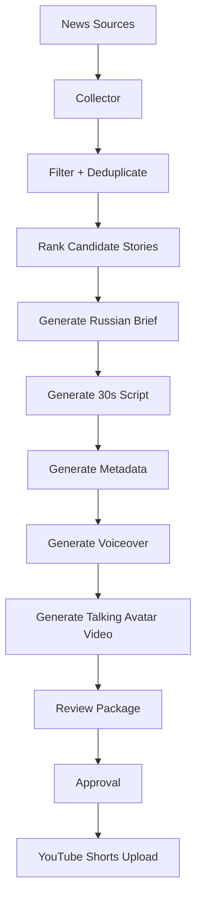

# Architecture

## System Objective
Build a daily or on-demand pipeline that turns recent AI product/model news into a 30-second Russian talking-avatar video for YouTube Shorts.

## High-Level Flow


## Main Modules

### 1. Collector
Pulls candidate stories from approved sources.

Inputs:
- RSS feeds
- official model/vendor blogs
- selected news APIs
- optional social sources later

Outputs:
- normalized list of raw stories with url, title, source, publish date, and body snippet

### 2. Filter + Deduplicate
Removes noise and keeps only relevant AI engine/model/tool launches or updates.

Rules:
- keep only AI launch/update/model/API/inference/tool stories
- ignore generic market noise unless directly tied to a product release
- collapse duplicate coverage of the same announcement
- prefer primary source over third-party retelling

### 3. Story Ranker
Chooses the best story for a short.

Ranking factors:
- recency
- source reliability
- novelty
- relevance to "AI novinki / dvizhki"
- explainability in 30 seconds
- likely audience interest

### 4. Russian Brief Generator
Creates a factual internal summary before scriptwriting.

Output fields:
- what happened
- who released it
- what is new
- why it matters
- risks or caveats
- source links

### 5. Script Generator
Turns the brief into a short Russian spoken script.

Constraints:
- target 65-85 spoken Russian words
- strong opening in first 2-3 seconds
- no fluff
- one main story per short
- clear close

### 6. Metadata Generator
Creates:
- short headline
- YouTube title
- description
- hashtags
- thumbnail idea

### 7. Voice + Avatar Layer
Converts the script into a talking-head or avatar clip.

Inputs:
- Russian script
- selected voice
- avatar preset
- optional background loop

Outputs:
- vertical 9:16 short video

### 8. Review Layer
Before publish, package the run for approval.

Review package:
- chosen story
- source links
- final script
- metadata
- preview link or local file

### 9. Publish Layer
Uploads approved output to YouTube Shorts.

## Data Objects

### StoryCandidate
```json
{
  "id": "string",
  "title": "string",
  "url": "string",
  "source": "string",
  "published_at": "ISO datetime",
  "snippet": "string",
  "is_primary_source": true
}
```

### SelectedStory
```json
{
  "id": "string",
  "headline": "string",
  "source_urls": ["string"],
  "why_it_matters_ru": "string",
  "factual_summary_ru": "string"
}
```

### VideoDraft
```json
{
  "title_ru": "string",
  "script_ru": "string",
  "description_ru": "string",
  "hashtags": ["string"],
  "voice_provider": "string",
  "avatar_provider": "string",
  "video_url": "string"
}
```

## Review Strategy
Current mode:
- manual review in this workspace

Next mode:
- Telegram message with preview link and summary
- approve or reject action

Final mode:
- automatic publish after explicit approval

## Recommended MVP Sequence
1. Manual run
2. Manual review
3. Manual publish

Then:
1. Scheduled run
2. Telegram review
3. Automatic publish after approval

## Risks
- low-quality or duplicate news selection
- hallucinated facts in summaries
- avatar/video cost overruns
- poor spoken pacing for 30-second target
- YouTube metadata drift from actual facts

## Guardrails
- always attach source links
- always prefer primary sources
- never publish if the summary contains uncertainty not reflected in the script
- reject stories that require too much context for 30 seconds
